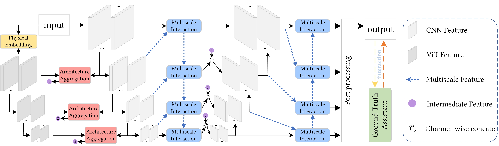
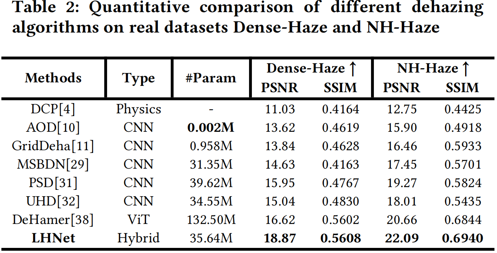
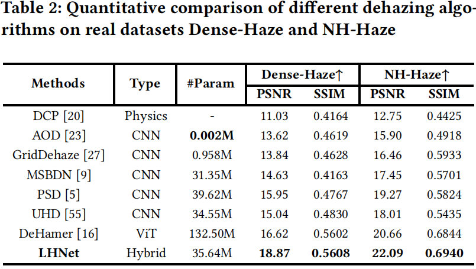

<p align="center">
    
</p>
   
# LHNet: A Low-cost Hybrid Network for Single Image Dehazing

## News
* **[2024.1.09]**  We have comprehensively improved the performance of LHNetV1, especially the inference speed, and latest paper is currently under review. The code of LHNetV2 will be released after the latest paper is accepted.

## Overview

This repository contains the **offical** PyTorch implementation of paper:

*LHNet: A Low-cost Hybrid Network for Single Image Dehazing*, ACM MM 2023

<a href="https://dl.acm.org/doi/abs/10.1145/3581783.3612594">[Paper Link]</a>



## Dependences

1. Clone Repo

   ```
   git clone https://github.com/SHYuanBest/LHNet-ACM-MM-23.git
   cd LHNet-ACM-MM-23-main/
   ```

2. Create a virtual environment via `conda`.

   ```python
   conda create -n LHNet python=3.7
   conda activate LHNet
   ```

3. Install requirements.

   ```python
   pip install -r requirements.txt
   ```

4. Download pre-trained models.

   - Download the pre-trained generator and discriminator from [here](https://drive.google.com/file/d/1EM87UquaoQmk1q5c6kYIAHqu0dkYqdT/view?usp=sharing), and place it into the folder `./ckpts`

     ```
     ckpts
        |- ITS
           |- ITS.pt
        |- OTS
           |- OTS.pt
        |- Dense
           |- Dense.pt  
        |- NH
           |- NH.pt
     ```

5. Data preparing.

   - LHNet is trained on RESIDE-ITS, RESIDE-OTS, DENSE-HAZE and NH-HAZE.

   - Download all the datasets and place it into the folder `./datasets`.

     <table>
     <thead>
       <tr>
         <th>Dataset</th>
         <th>RESIDE-ITS</th>
         <th>RESIDE-OTS</th>
         <th>Dense-Haze</th>
         <th>NH-HAZE</th>
         <th>SOTS-ITS/OTS</th>
       </tr>
     </thead>
     <tbody>
       <tr>
         <td>Details</td>
         <td>about 4.5G</td>
         <td>about 45G</td>
         <td>about 250M</td>
         <td>about 315M</td>
         <td>about 415M</td>   
       <tr>
         <td>Google drive</td>
         <td> <a href="https://drive.google.com/file/d/1lE6FyHS-1MHoV6iM_s7phgf3Z3XJeC9E/view?usp=share_link">Google drive</a> </td>
         <td> <a href="https://drive.google.com/drive/folders/1i_tW1axmOjOy1InX1o3iS1nLnJ8TND7f?usp=sharing">Google drive</a></td>
         <td> <a href="https://drive.google.com/file/d/1OOyeu2pDM_OuE84qbV3eBy4pfP4xorVq/view?usp=sharing">Google drive</a> </td>
         <td> <a href="https://drive.google.com/file/d/1qPYGkCfVgn1Ami7ksf0DmKeKsoHVnm8i/view?usp=sharing">Google drive</a> </td>
         <td> <a href="https://drive.google.com/file/d/1IyZPih5BXB9ffgKneXf_FVpLus6Egmfn/view?usp=sharing">Google drive</a></td>
       </tr>
     </tbody>
     </table>

     The directory structure will be arranged as:

     ```
     datasets
        |-ITS
           |- train_ITS
              |- haze
              |- clear_images
              |- trainlist.txt
           |- valid_ITS
              |- input
              |- gt
              |- val_list.txt
        |-OTS   
           |- train_OTS
              |- haze
              |- clear_images
              |- trainlist.txt
           |- valid_OTS
              |- input
              |- gt
              |- val_list.txt
        |-Dense-Haze
           |- train_Dense
              |- haze
              |- clear_images
              |- trainlist.txt
           |- valid_Dense
              |- input 
              |- gt
              |- val_list.txt
        |-NH-Haze
           |- train_NH
              |- haze
              |- clear_images
              |- trainlist.txt
           |- valid_NH
              |- input 
              |- gt
              |- val_list.txt
     ```

   - Or you can customize the dataset to follow the data format as shown before.

## Training

See `python src/train.py --h` for list of optional arguments.

An example:

```python
CUDA_VISIBLE_DEVICES=0 python src/train.py \
  --dataset-name your_choice \
  --data-dir ../datasets \
  --ckpt-save-path ../weights \
  --ckpt-load-path ../ckpts/your_choice.pt
  --nb-epochs 2000 \
  --batch-size 8 \
  --train-size 512 512 \
  --valid-size 512 512 \
  --loss l1 \
  --plot-stats \
  --cuda True
```

## Evaluation

See `python src/test.py --h` for list of optional arguments.

An example:

```python
CUDA_VISIBLE_DEVICES=0 python src/test.py \
  --dataset-name your_choice \
  --data-dir your_choice \
  --ckpts-dir your_choice \
  -val_batch_size 1
```

## Results





## Citing LHNet
If you find LHNet useful in your research, please consider citing our paper:
```
@inproceedings{yuan2023lhnet,
  title={LHNet: A Low-cost Hybrid Network for Single Image Dehazing},
  author={Yuan, Shenghai and Chen, Jijia and Li, Jiaqi and Jiang, Wenchao and Guo, Song},
  booktitle={Proceedings of the 31st ACM International Conference on Multimedia},
  pages={7706--7717},
  year={2023}
}
```

## Contact

If you have any question, please feel free to contact us via `shyuan-cs@hotmail.com`

## Acknowledge

This code is based on [UNet](https://github.com/milesial/Pytorch-UNet), [Swin-Transformer](https://github.com/microsoft/Swin-Transformer) and [Dehamer](https://github.com/Li-Chongyi/Dehamer).

