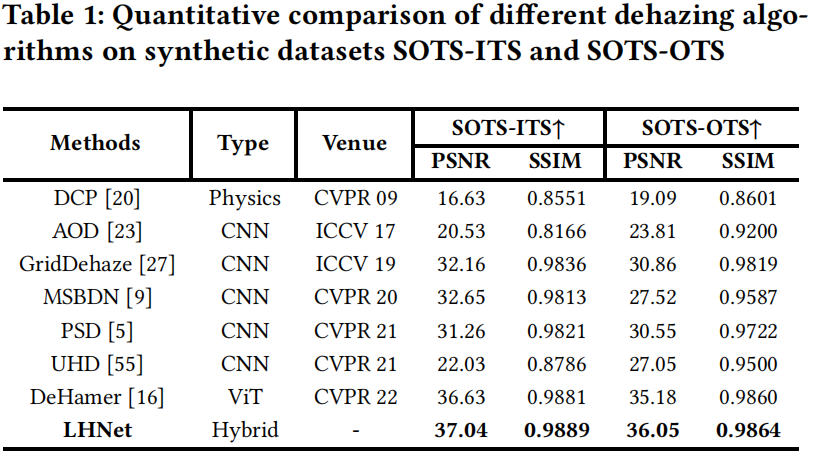

# LHNet: A Low-cost Hybrid Network for Single Image Dehazing (ACM MM 2023)
The code will be released after checking

## Quantitative results

  


## Qualitative results 
 
  


## Requirements

## Installation

## Training

## Evaluation

## Citing LHNet
If you find LHNet useful in your research, please consider citing our paper:
```
@article{,
  title={},
  author={},
  year={2023}
}
```

### Reference
